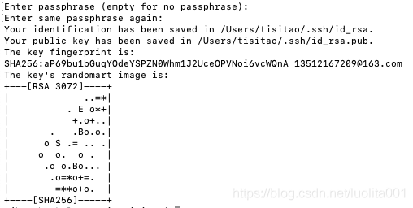
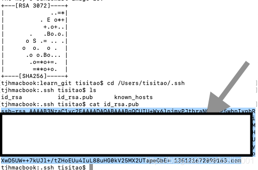

# kyodai_flea_market_app
Practice of Infomation System 8班

# Recommond system
Stiky
## This is the introduce doc to inite the git

## step 1

Install Git.

```shell

# enter the codebase path
cd workspace/
# check the dir
ls -a
# inite the code base
git init
# setup your username 
git config --global user.name "username"
# setup your email address
git config --global user.email "...@gmail.com"

# checking your setting info

git config --global --list

# setting remote code base url 
git remote add origin git@github.com:arakawakengo/kyodai_flea_market_app.git

# setting ssh key
ssh-keygen -t rsa -C "username"

# enter the dir that storage ssh key 
cd ~/.ssh
# show the file 
ls
# show the content of rsa key
cat id_rsa.pub

```