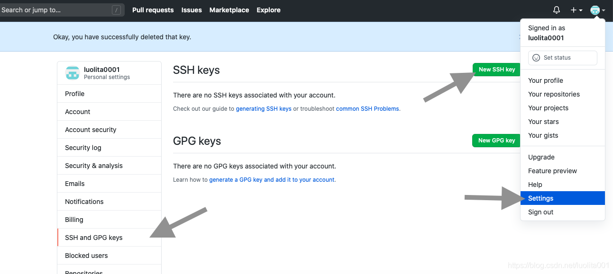
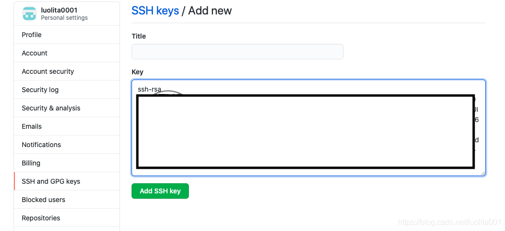

# kyodai_flea_market_app
Practice of Infomation System 8班

# Recommond system

## This is the introduce doc to inite the git

## step 1

Install Git.

```shell

# enter the codebase path
cd workspace/
# check the dir
ls -a
# inite the code base
git init
# setup your username 
git config --global user.name "username"
# setup your email address
git config --global user.email "...@gmail.com"

# checking your setting info

git config --global --list

# setting remote code base url 
git remote add origin git@github.com:arakawakengo/kyodai_flea_market_app.git

# setting ssh key
ssh-keygen -t rsa -C "username"
```

```
# enter the dir that storage ssh key 
cd ~/.ssh
# show the file 
ls
# show the content of rsa key
cat id_rsa.pub
```

### Paste the id_rsa.pub to Github


### Test the Link 


```
ssh -T git@github.com
```
### push your code to remote branch

```
git push -u origin main
```

## 環境構築 / Build a development environment
- リポジトリをclone / Clone this repository
```
git clone https://github.com/arakawakengo/kyodai_flea_market_app.git
```
- Djangoのインストール / Install Django
```
cd kyodai_flea_market_app
pip install django
```

- Vue.jsのインストール / Install Vue.js
```
cd market_app
npm install
```
### 備考 / Note
- ```npm install```は、```/kyodai_flea_market_app/market_app/```で実行すること。
- ```npm install``` を実行することで、market_app/package.jsonに定義されているパッケージ(Vueなど)をまとめてインストールできます。
- ```npm install`` should be run in ```/kyodai_flea_market_app/market_app/``.
- By running ```npm install```, the packages (Vue, etc.) defined in market_app/package.json can be installed at once.


## VueとDjangoのサーバーを起動できるか確認 / Check if you can start Vue or Django server
### Vue
- ```/kyodai_flea_market_app/```フォルダにいることを確認 / Make sure you are in ```/kyodai_flea_market_app/```
```
cd market_app
npm run serve
```
http://localhost:8080/ にアクセスしてVueの画面が表示されればOK

Go to http://localhost:8080/ and if you see the Vue screen, you're good to go.


### Django
- ```/kyodai_flea_market_app/```フォルダにいることを確認 / Make sure you are in ```/
kyodai_flea_market_app```

```
python manage.py runserver
```

http://localhost:8000/ にアクセスしてDjangoの画面が表示されればOK

Go to http://localhost:8000/ and if you see the Django screen, you're good to go.
